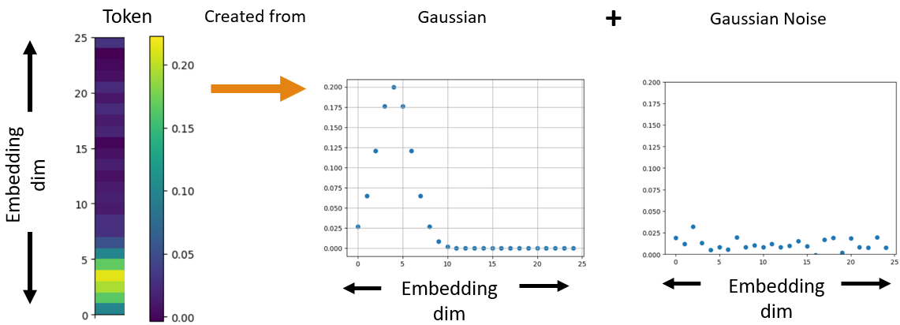
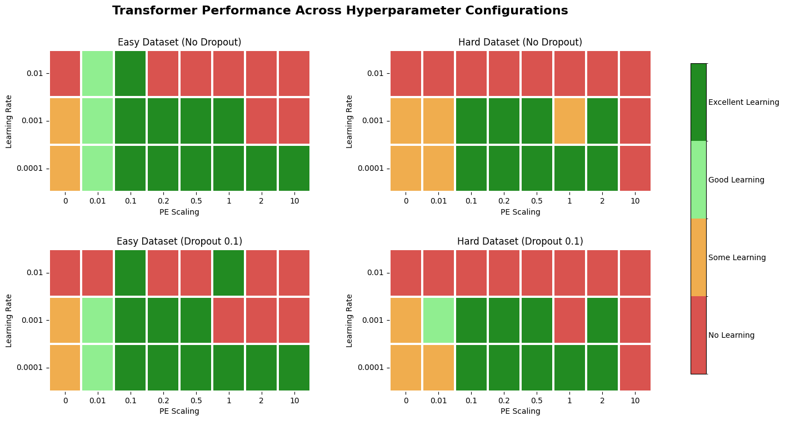

# Toy Dataset - Transformer Testing

[](https://opensource.org/licenses/MIT)
[](https://www.python.org/downloads/)

This Repo presents a toy dataset for testing your transformer (or other model) implementation.
We also include some of our results from testing impact of Positional Encoding Scaling, Learning Rate changes and Drop Out on transformer performance using this toy data. 

---

## 📖 Toy Dataset Explained

I have created two binary classification tasks using sequences of 16 tokens. Each token is a 25-dimensional vector generated from a Gaussian distribution with some added noise. The position of the Gaussian's peak is what defines the token as shown in the figure below:





### Sequence Generation

For sequence generation we split the 25 Embedding dimensions into 5 sections as follows : 0-5 as V.Low, 5-10 as Low, 10-15 as Medium, 15-20 as High and 20-25 as V.High.
To begin a sequence a random section out of the 5 is selected to place the mean / peak of the Gaussian. A random position within the chosen section is then selected to place the exact mean of the Gaussian. For example Low could be chosen first within the sections and then 3.2 chosen as the position within the section to place the Gaussian mean. The token is then generated with the specified gaussian mean and gaussian noise added. To simulate some time dependancy each subsequent token mean will be in either the same section, one section lower or one section higher with equal probability. Therefore if one token has a mean in the Low section then a subsequent token can only have a mean in the V.Low, Low or Medium sections.

#### Task 1 (Easy Task)
This task tests if a model can spot a simple, repeated pattern.

* Class 1: A sequence of 5 random tokens, followed by 3 random tokens, then the same 5 tokens are repeated, and it ends with 3 new random tokens.
* Class 2: A sequence of 4 random tokens, then 5 random tokens, then the same 4 tokens are repeated, and it ends with 3 new random tokens.


#### Task 2 (Harder Task)

This task is more difficult because the the positions at which the repeated patterns occur changes within each class instead of staying fixed.

* Class 1:  A core pattern of 13 tokens (5 random, then 3 random, then the first 5 repeated) is placed within the 16-token sequence. This leaves 3 "padding" tokens that can be placed at the beginning or end of the sequence. Therefore a sequence from this class could be 2 padding - 5 random - 3 random - 5 repeated - 1 padding Or 3 padding - 5 random - 3 random - 5 repeated etc..

* Class 2:  A different core pattern of 13 tokens (4 random, then 5 random, then the first 4 repeated) is also placed within the 16-token sequence with 3 "padding" tokens.

---

## 🚀 Getting Started

### 1. Set Up the Environment
First clone this repositiory and then install the necessary dependencies from the `requirements.txt` file.
This can be done with the following command:
```bash
pip install -r requirements.txt
```

### 2. Generate the Datasets

This is the main part of the project. Run the provided script 'Generate_Datasets.py' to generate both the "Easy" and "Hard" task datasets.

```bash
python Generate_Datasets.py
```

This script will create two files, `Easy_task_toy_data_binary.pkl` and `Harder_task_toy_data_binary.pkl`, and save them in the `Dataset/` folder. Each file is approximately 400MB.
These datasets are dictionarys with the samples and labels saved as numpy arrays. The dictionary keys to reference the samples and labels are 'train_data', 'val_data', 'test_data' and 'train_label', 'val_label' , 'test_label'.

### 3. (Optional) Run the Example Transformer Tests

We've included scripts in the `Transformer_Encoder/` folder to show how the generated datasets can be used to test a Transformer model. To run the test on the easy dataset, for example, you would execute:

```bash
python Transformer_Encoder/Encoder_Toy_Dataset_Easy.py
```

This will train the model using different values of learning rate / positional encoding scaling and save plots of the training and validation losses to the `Results/` folder.

---

## Our Results from Transformer Testing 
We present our results from transformer testing on our tasks in summary qualitative figure below for both the easy and the hard tasks - we experiment with and without dropout of 10% (applied directly after transformer encoder layer) , with multiple learning rates and multiple scaling factors using a transformer encoder with five attention heads.

Following 70 epochs of training excellent learning corresponds to approximately 100% accuracy for model predictions, good learning corresponds to 80%+ accuracy of model predictions, some learning corresponds to better than random chance (60%+ accuracy) and no learning means the model does not do significantly better than random chance (50% on this data). 

Our results make sense intuitively, the easy task has higher performance overall vs. the harder task. A dropout of 10% vs. no dropout has a small positive impact on learning. The best parameters for learning from those tested were found to be modest PE scaling of 0.1 - 2 with a learning rate of 0.0001. A larger learning rate of 0.001 also worked well but this had a narrower band of acceptable PE scaling (0.1-0.5). 

Please see the Figure below for a summary of our results: 





### Note Re: Scaled Positional Encoding Implementation

To explore the impact of the magnitude of positional encodings we multiply the positional encodings from the original [transformer paper](https://arxiv.org/abs/1706.03762) by a scaling factor. Where pos is the position of the token in the sequence, i is the dimension within the embedding vector and d_model is the total dimension of the embedding: 

```math
PE_{(pos, 2i)} = \sin(pos / 10000^{2i / d_{\text{model}}}) \\
PE_{(pos, 2i+1)} = \cos(pos / 10000^{2i / d_{\text{model}}})
```

With the scaling factor added these equations for positional encoding simply become: 

```math
PE_{(pos, 2i)} = ScalingFactor*\sin(pos / 10000^{2i / d_{\text{model}}}) \\
PE_{(pos, 2i+1)} = ScalingFactor*\cos(pos / 10000^{2i / d_{\text{model}}})
```

---